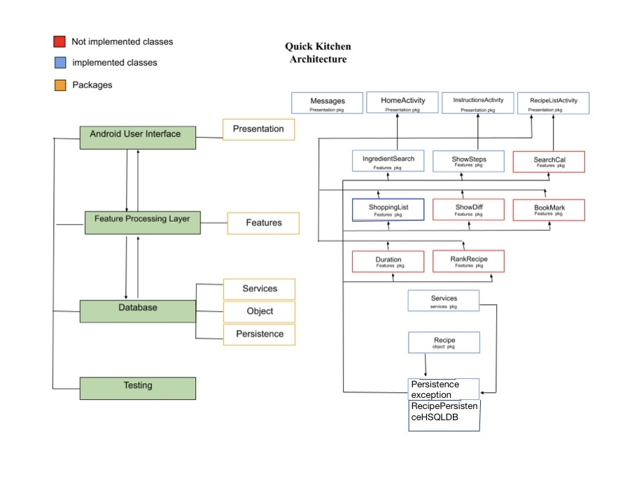

# Quick Kitchen - Architecture

The overall structure of this application is divided into 4 different parts. These are:

- Android User Interface
- Feature Processing Layer
- Database
- Testing

**Android User Interface**

The android user interface is the media that connects the user with the system. It is responsible for the decorative visual representation of the application, taking proper command from the user and sending it to the back-end system, and showing the requested item on it. The **presentation** package is the user interface part of the program.

**Feature Processing Layer**

The feature processing layer is the part where the user request comes, is processed, and sends it back to the user interface accordingly. The package named **features** is responsible for his part. This part of the application is connected to both the user interface and the database. When a user requests something, the request comes from the user interface to this portion of the application. After that, this feature layer processes the request and finds the desired information from the database, and sends it back to the user interface.

**Database**

The database layer is part of the architecture where all data is stored. This portion is the **persistence** package of the code.

**Testing**

The testing part is mostly for development purposes which helps to increase the reliability and accuracy of the application. This portion of this application is responsible to test every function and feature of this system. The code for testing sits under the **test** folder.

**Objects**

There is another package which is **objects**. This package holds all the objects that are being used for the application.

**Database details**

**Table Name: RECIPES**

This table stores information about the recipes in the database.
The columns in this table are:

- RECIPEID: An integer value that uniquely identifies each recipe in the database. This column is the primary key for the table.
- RECIPENAME: A string value that represents the name of the recipe.
- DIFFICULTY: A string value that represents the difficulty level of the recipe.
- INGREDIENT: A string value that lists the ingredients required to make the recipe.
- PORTION: A string value that represents the number of portions the recipe makes.
- CALORIES: A string value that represents the estimated number of calories per serving for the recipe.
- STEPS: A string value that lists the steps required to make the recipe.
- VEGETARIAN: An integer value that represents whether the recipe is vegetarian (1) or not (0).
- GLUTENFREE: An integer value that represents whether the recipe is gluten-free (1) or not (0).
- DIARYFREE: An integer value that represents whether the recipe is dairy-free (1) or not (0).
- DURATION: A double value that represents the estimated time required to make the recipe.

**Table Name: INGREDIENTS**

This table stores information about the ingredients used in the recipes in the database. The columns in this table are:

- INGREID: An integer value that uniquely identifies each ingredient in the database. This column is the primary key for the table.
- INGRENAME: A string value that represents the name of the ingredient.

**Table Name: RECIPEINGREDIENT**

A recipe can have many ingredients and an ingredient can be used in many recipes. So, the RECIPEINGREDIENT table allows us to creates a many-to-many relationship between the RECIPES and INGREDIENTS tables.

This table stores information about the relationship between recipes and their ingredients. The columns in this table are:

- RECIPEID: An integer value that represents the recipe ID for a specific recipe. This column is a foreign key that references the RECIPEID column in the RECIPES table.
- INGREID: An integer value that represents the ingredient ID for a specific ingredient. This column is a foreign key that references the INGREID column in the INGREDIENTS table.
- CONSTRAINT1: A primary key constraint that ensures that each recipe-ingredient pairing is unique in the table.
- CONSTRAINT2: A foreign key constraint that ensures that the RECIPEID column in this table references a valid RECIPEID in the RECIPES table.
- CONSTRAINT3: A foreign key constraint that ensures that the INGREID column in this table references a valid INGREID in the INGREDIENTS table.

**Overall visual representation**

