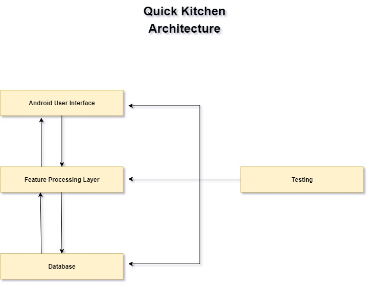

Quick Kitchen - Architecture
======================

The overall structure of this application is divided into 4 different parts. These are:

* Android User Interface
* Feature Processing Layer
* Database
* Testing

The android user interface is the media that connects the user with the system. It is responsible for the decorative visual representation of the application, taking proper command from the user and sending it to the back-end system, and showing the requested item on it. The **presentation** package is the user interface part of the program.

The feature processing layer is the part where the user request comes, is processed, and sends it back to the user interface accordingly. The package named **features** is responsible for his part. This part of the application is connected to both the user interface and the database. When a user requests something, the request comes from the user interface to this portion of the application. After that, this feature layer processes the request and finds the desired information from the database, and sends it back to the user interface.

The database layer is part of the architecture where all data is stored. This portion is the **persistence** package of the code.

The testing part is mostly for development purposes which helps to increase the reliability and accuracy of the application. This portion of this application is responsible to test every function and feature of this system. The code for testing sits under the **test** folder. 

There is another package which is **objects**. This package holds all the objects that are being used for the application. 

